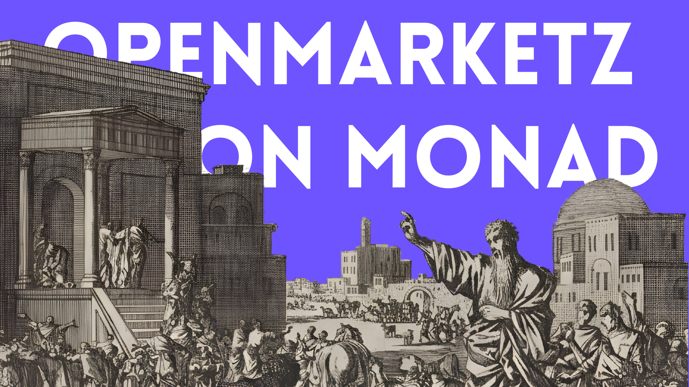

# OpenMarketz

OpenMarketz is a permissionless prediction market protocol on Monad where anyone can create a YES/NO market, share it with an OPEN code, and let participants trade outcomes on-chain.

The system currently includes:
- V1 market contract (`OpenMarketz`) for classic pooled prediction markets.
- V2 AMM contract (`OpenMarketzAMM`) for share-based trading, liquidity management, and creator resolution.
- Next.js frontend for market creation, trading, portfolio views, and protocol stats.

## Project Goals

- Remove gatekeepers from market creation.
- Make market discovery and sharing simple with OPEN codes.
- Keep settlement transparent and verifiable on-chain.
- Support a social trust model where the market creator is the resolver.

## Architecture

OpenMarketz is split into two main applications:

1. Smart contracts (`openmarketz-contracts`)
- Hardhat-based Solidity workspace.
- Contains V1 and V2 contracts, deployment scripts, and tests.
- Owns market state, code mapping, trading/accounting rules, and settlement.

2. Frontend (`openmarketz-frontend`)
- Next.js App Router UI.
- Handles wallet connect, create market flow, AMM trading flows, portfolio pages, and stats rendering.
- Reads from contract view methods and submits signed transactions via MetaMask.

### Runtime Flow

1. User connects MetaMask on Monad testnet (chainId `10143`).
2. Creator opens a market with question, description, close time, and initial seed.
3. Contract generates and stores a unique `OPEN##########` code.
4. Participants open market pages via code and buy/sell YES or NO shares.
5. Creator resolves the market after close time.
6. Winners redeem payouts; fees are split per protocol rules.
7. Frontend hydrates created/invested portfolios with on-chain getters and shows cached protocol stats.

### Contract Roles (V2 AMM)

- Creator:
  Creates market, can add liquidity, and resolves outcome after close.
- Traders:
  Buy/sell YES or NO shares while market is open.
- Treasury:
  Receives treasury-side trade fees and winner profit fee.
- LP accounting:
  Tracks liquidity contribution and LP-side fee accrual.

## Repository Structure

```text
openmarketz/
├─ README.md
├─ OpenmarketzOnMonad.png
├─ codex-corner/            # Specs, decisions, and implementation logs
├─ docs/                    # Deployment/runbook docs
├─ openmarketz-contracts/   # Hardhat + Solidity contracts and tests
└─ openmarketz-frontend/    # Next.js frontend app
```

## Core Features

- Permissionless market creation.
- OPEN code lookup and sharing.
- AMM buy/sell for YES/NO shares.
- Creator-only post-create liquidity top-up.
- Creator resolution after market close.
- Winning redemption and protocol fee routing.
- Portfolio routes for created and participated markets.
- Landing stats with cache-backed API refresh.

## Tech Stack

- Solidity + Hardhat + TypeChain
- Next.js (App Router) + TypeScript
- Ethers.js + MetaMask
- Monad testnet
- Vercel KV + Cron (stats snapshot refresh)

## Quick Start

### 1) Contracts

```bash
cd openmarketz-contracts
npm install
npm run compile
npm run test
```

Deploy:

```bash
npm run deploy:testnet      # V1
npm run deploy:amm:testnet  # V2
```

### 2) Frontend

```bash
cd ../openmarketz-frontend
npm install
npm run dev
```

The app runs on `http://localhost:3069`.

## Environment Setup

Contracts (`openmarketz-contracts/.env`):

```env
MONAD_RPC_URL=https://testnet-rpc.monad.xyz
PRIVATE_KEY=your_testnet_private_key
TREASURY_ADDRESS=0x...
```

Frontend (`openmarketz-frontend/.env.local`):

```env
NEXT_PUBLIC_OPENMARKETZ_ADDRESS=0x...      # V1
NEXT_PUBLIC_OPENMARKETZ_AMM_ADDRESS=0x...  # V2
NEXT_PUBLIC_CHAIN_ID=10143
NEXT_PUBLIC_OPENMARKETZ_START_BLOCK=...
```

## Documentation

- `codex-corner/architecture.md` for high-level architecture and data flow.
- `codex-corner/contract-spec.md` for contract behavior and fee rules.
- `codex-corner/frontend-spec.md` for route and UX behavior.
- `docs/` for runbooks and deployment checklists.

## Current Scope

V1 and V2 contracts coexist, with frontend flows focused on V2 AMM routes (`/amm/[code]`, `/my-markets`) for showcase and active usage.

## License

Add your preferred license in this repository root (for example, MIT).